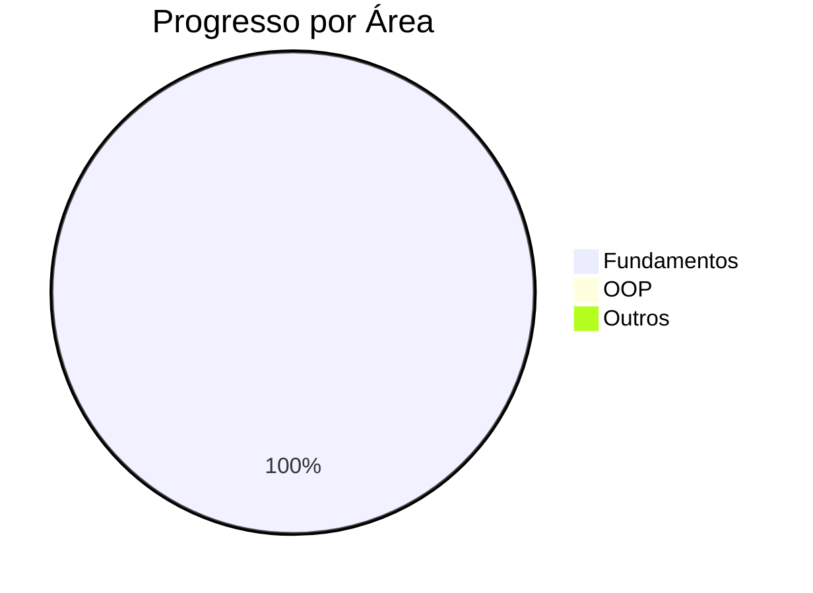

# ☕ Fiz logo uma garrafa porque hoje a madrugada vem 🔥


👋 Ooi,me chamo Adryel e este repositório documenta minha evolução no aprendizado de Java. Aqui você encontrará desde conceitos básicos até projetos mais complexos.

## 🚀 Sobre o Projeto

Este repositório serve como:
- 📓 Caderno de anotações sobre Java
- 🧪 Laboratório para experimentos com programação orientada a objetos
- 📂 Organização de exercícios resolvidos
- 🌱 Registro do meu crescimento como desenvolvedor Java

## 🧩 Tópicos Abordados

```java
public class Topicos {
    public static void main(String[] args) {
        String[] tópicos = {
            "✔️ Sintaxe básica",
            "✔️ Estruturas de controle",
            "🔄 Orientação a Objetos",
            "⏳ Coleções",
            "⏳ Tratamento de exceções",
            "⏳ Streams API"
        };
        
        for(String topico : tópicos) {
            System.out.println(topico);
        }
    }
}
```


## 🎯 Metas de Aprendizado

- [ ] Dominar sintaxe básica
- [ ] Compreender estruturas de controle
- [ ] Aprender OOP (Classes, Herança, Polimorfismo)
- [ ] Implementar 15 exercícios resolvidos

## 📊 Progresso Atual



## 🤝 Como Contribuir

1. Faça um Fork do projeto
2. Crie uma branch para sua feature (`git checkout -b feature/incrivel`)
3. Commit suas mudanças (`git commit -am 'Adiciona feature incrível'`)
4. Push para a branch (`git push origin feature/incrivel`)
5. Abra um Pull Request


---
"O código é poesia lógica que transforma ideias em realidade." ✨
